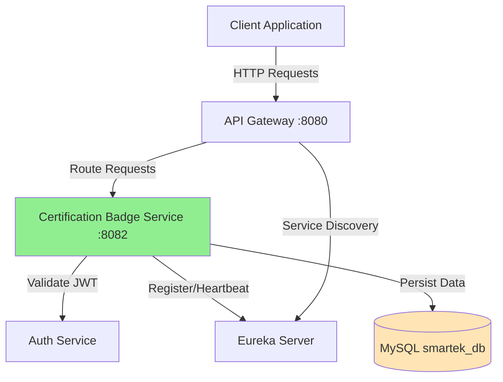
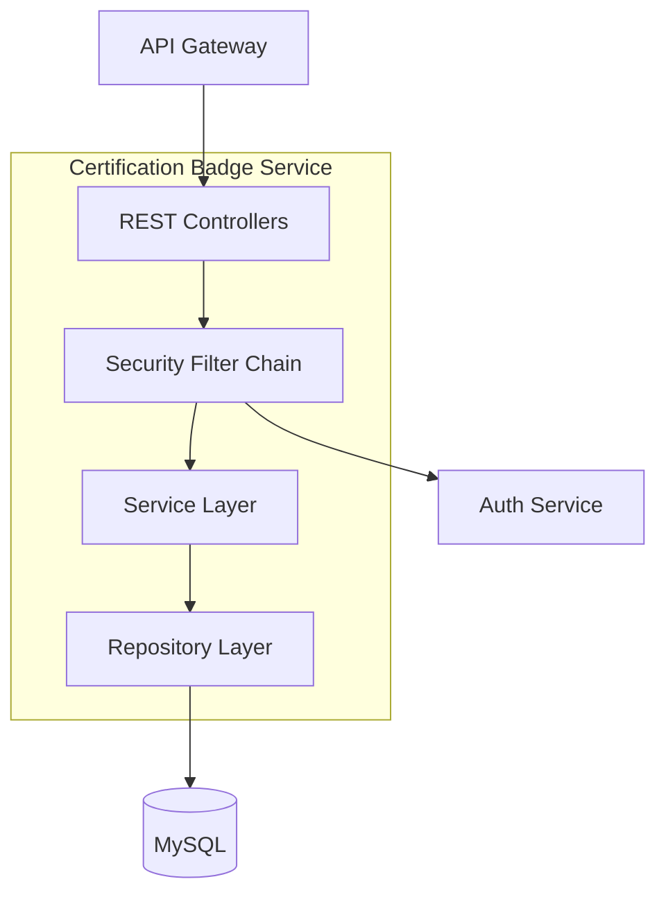
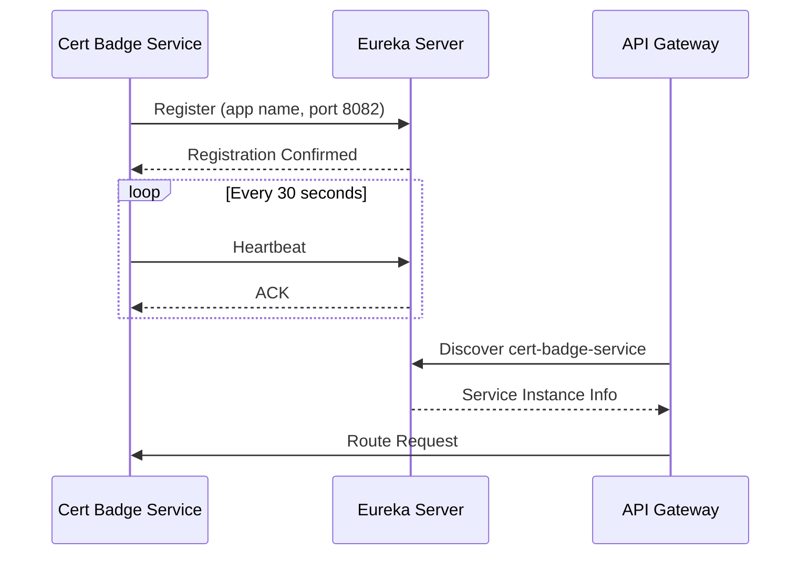
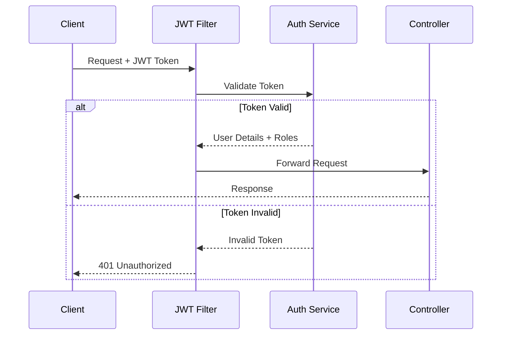
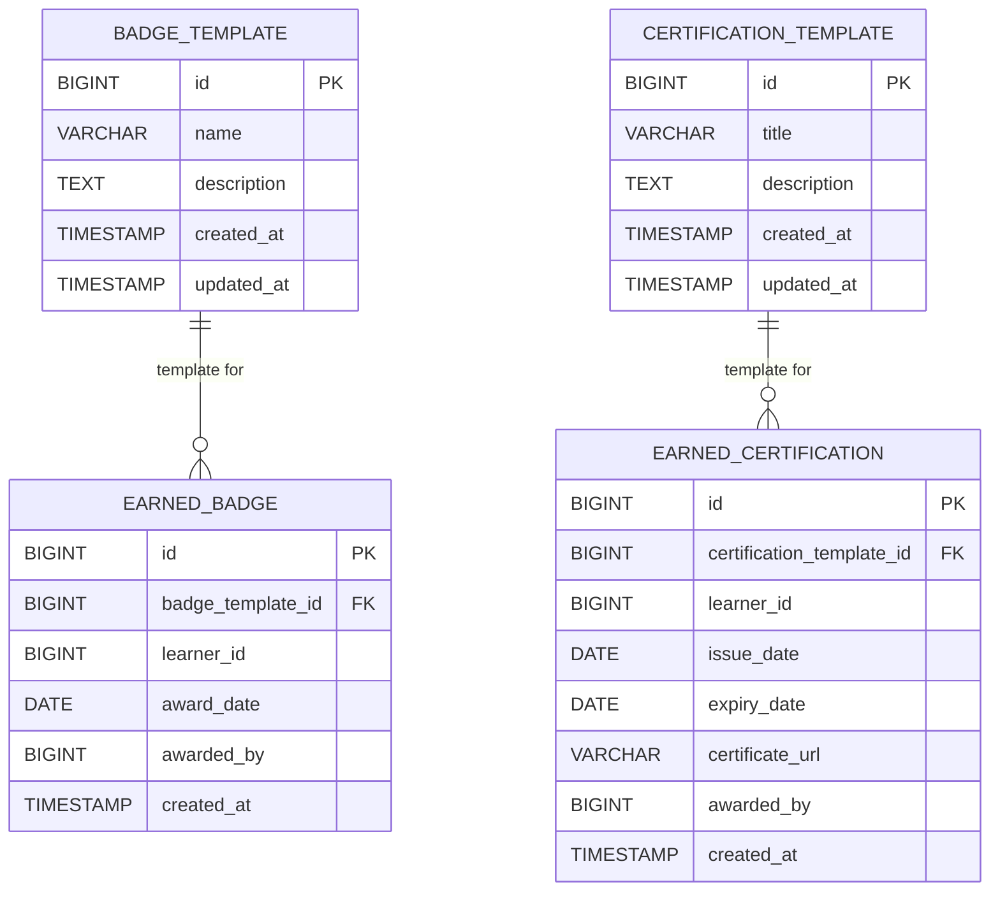

# Design Document: Certification and Badge Management System

## Overview

The Certification and Badge Management System is a Spring Boot microservice that enables the SMARTEK learning platform to issue, manage, and display digital certifications and badges. The service provides RESTful APIs for creating achievement templates, awarding them to learners, and querying earned credentials. It integrates with the existing microservices architecture using Eureka service discovery and the API Gateway, and leverages the Auth Service for JWT-based authentication and role-based authorization.

The system supports four user roles:
- **ADMIN**: Full access to all operations
- **TRAINER**: Can create templates and award achievements
- **LEARNER**: Can view their own achievements
- **RH_COMPANY/RH_SMARTEK**: Can view learner achievements for reporting purposes

The service runs on port 8082 and persists data to the existing MySQL smartek_db database.

## Architecture

### System Context



### Microservice Architecture

The Certification Badge Service follows a layered architecture pattern:



**Layer Responsibilities:**

1. **REST Controllers**: Handle HTTP requests, validate input, return appropriate HTTP responses
2. **Security Filter Chain**: Intercept requests, validate JWT tokens, enforce role-based access control
3. **Service Layer**: Implement business logic, coordinate operations, handle transactions
4. **Repository Layer**: Provide data access abstraction using Spring Data JPA

### Service Registration Flow



## Components and Interfaces

### REST API Endpoints

All endpoints are prefixed with `/api/certifications-badges` and accessed through the API Gateway.

#### Badge Template Endpoints

| Method | Endpoint | Role Required | Description |
|--------|----------|---------------|-------------|
| POST | `/badge-templates` | TRAINER, ADMIN | Create a new badge template |
| PUT | `/badge-templates/{id}` | TRAINER, ADMIN | Update an existing badge template |
| GET | `/badge-templates` | ALL | Get all badge templates |
| GET | `/badge-templates/{id}` | ALL | Get a specific badge template |
| DELETE | `/badge-templates/{id}` | TRAINER, ADMIN | Delete a badge template |

#### Certification Template Endpoints

| Method | Endpoint | Role Required | Description |
|--------|----------|---------------|-------------|
| POST | `/certification-templates` | TRAINER, ADMIN | Create a new certification template |
| PUT | `/certification-templates/{id}` | TRAINER, ADMIN | Update an existing certification template |
| GET | `/certification-templates` | ALL | Get all certification templates |
| GET | `/certification-templates/{id}` | ALL | Get a specific certification template |
| DELETE | `/certification-templates/{id}` | TRAINER, ADMIN | Delete a certification template |

#### Award Endpoints

| Method | Endpoint | Role Required | Description |
|--------|----------|---------------|-------------|
| POST | `/earned-badges` | TRAINER, ADMIN | Award a badge to a learner |
| POST | `/earned-badges/bulk` | TRAINER, ADMIN | Award a badge to multiple learners |
| POST | `/earned-certifications` | TRAINER, ADMIN | Award a certification to a learner |
| POST | `/earned-certifications/bulk` | TRAINER, ADMIN | Award a certification to multiple learners |

#### Query Endpoints

| Method | Endpoint | Role Required | Description |
|--------|----------|---------------|-------------|
| GET | `/earned-badges/learner/{learnerId}` | LEARNER (own), TRAINER, ADMIN, RH | Get earned badges for a learner |
| GET | `/earned-certifications/learner/{learnerId}` | LEARNER (own), TRAINER, ADMIN, RH | Get earned certifications for a learner |

#### Statistics Endpoints

| Method | Endpoint | Role Required | Description |
|--------|----------|---------------|-------------|
| GET | `/statistics/badges` | ADMIN, RH | Get badge award statistics |
| GET | `/statistics/certifications` | ADMIN, RH | Get certification award statistics |
| GET | `/statistics/learners/{learnerId}` | ADMIN, RH | Get achievement statistics for a learner |

### Request/Response DTOs

#### BadgeTemplateDTO
```java
{
  "id": Long,
  "name": String,           // max 100 chars, required
  "description": String     // max 1000 chars, optional
}
```

#### CertificationTemplateDTO
```java
{
  "id": Long,
  "title": String,          // max 200 chars, required
  "description": String     // max 1000 chars, optional
}
```

#### AwardBadgeRequestDTO
```java
{
  "badgeTemplateId": Long,  // required
  "learnerId": Long,        // required
  "awardedBy": Long         // extracted from JWT
}
```

#### BulkAwardBadgeRequestDTO
```java
{
  "badgeTemplateId": Long,  // required
  "learnerIds": List<Long>, // required, max 100
  "awardedBy": Long         // extracted from JWT
}
```

#### AwardCertificationRequestDTO
```java
{
  "certificationTemplateId": Long,  // required
  "learnerId": Long,                // required
  "issueDate": LocalDate,           // required
  "expiryDate": LocalDate,          // optional
  "certificateUrl": String,         // optional, validated URL format
  "awardedBy": Long                 // extracted from JWT
}
```

#### BulkAwardCertificationRequestDTO
```java
{
  "certificationTemplateId": Long,  // required
  "learnerIds": List<Long>,         // required, max 100
  "issueDate": LocalDate,           // required
  "expiryDate": LocalDate,          // optional
  "certificateUrl": String,         // optional
  "awardedBy": Long                 // extracted from JWT
}
```

#### EarnedBadgeDTO
```java
{
  "id": Long,
  "badgeTemplate": BadgeTemplateDTO,
  "learnerId": Long,
  "awardDate": LocalDate,
  "awardedBy": Long
}
```

#### EarnedCertificationDTO
```java
{
  "id": Long,
  "certificationTemplate": CertificationTemplateDTO,
  "learnerId": Long,
  "issueDate": LocalDate,
  "expiryDate": LocalDate,
  "certificateUrl": String,
  "awardedBy": Long,
  "isExpired": Boolean              // computed field
}
```

#### BulkAwardResponseDTO
```java
{
  "successCount": Integer,
  "failureCount": Integer,
  "results": List<AwardResultDTO>
}
```

#### AwardResultDTO
```java
{
  "learnerId": Long,
  "success": Boolean,
  "errorMessage": String            // present only if success = false
}
```

#### BadgeStatisticsDTO
```java
{
  "badgeTemplateId": Long,
  "badgeName": String,
  "totalAwarded": Long
}
```

#### CertificationStatisticsDTO
```java
{
  "certificationTemplateId": Long,
  "certificationTitle": String,
  "totalAwarded": Long
}
```

#### LearnerStatisticsDTO
```java
{
  "learnerId": Long,
  "totalBadges": Long,
  "activeCertifications": Long,
  "expiredCertifications": Long
}
```

### Security Components

#### JWT Authentication Filter

Intercepts all incoming requests and validates JWT tokens:



#### Authorization Rules

Implemented using Spring Security method-level annotations:

- `@PreAuthorize("hasAnyRole('TRAINER', 'ADMIN')")` - Template CRUD and award operations
- `@PreAuthorize("hasAnyRole('ADMIN', 'RH_COMPANY', 'RH_SMARTEK')")` - Statistics endpoints
- Custom authorization logic for learner-specific queries (learners can only access their own data)

## Data Models

### Database Schema



### Entity Definitions

#### BadgeTemplate Entity
```java
@Entity
@Table(name = "badge_template")
public class BadgeTemplate {
    @Id
    @GeneratedValue(strategy = GenerationType.IDENTITY)
    private Long id;
    
    @Column(nullable = false, length = 100)
    private String name;
    
    @Column(length = 1000)
    private String description;
    
    @Column(name = "created_at", nullable = false, updatable = false)
    private LocalDateTime createdAt;
    
    @Column(name = "updated_at")
    private LocalDateTime updatedAt;
    
    @OneToMany(mappedBy = "badgeTemplate", cascade = CascadeType.PERSIST)
    private List<EarnedBadge> earnedBadges;
}
```

#### CertificationTemplate Entity
```java
@Entity
@Table(name = "certification_template")
public class CertificationTemplate {
    @Id
    @GeneratedValue(strategy = GenerationType.IDENTITY)
    private Long id;
    
    @Column(nullable = false, length = 200)
    private String title;
    
    @Column(length = 1000)
    private String description;
    
    @Column(name = "created_at", nullable = false, updatable = false)
    private LocalDateTime createdAt;
    
    @Column(name = "updated_at")
    private LocalDateTime updatedAt;
    
    @OneToMany(mappedBy = "certificationTemplate", cascade = CascadeType.PERSIST)
    private List<EarnedCertification> earnedCertifications;
}
```

#### EarnedBadge Entity
```java
@Entity
@Table(name = "earned_badge",
       uniqueConstraints = @UniqueConstraint(
           columnNames = {"badge_template_id", "learner_id"}
       ))
public class EarnedBadge {
    @Id
    @GeneratedValue(strategy = GenerationType.IDENTITY)
    private Long id;
    
    @ManyToOne(fetch = FetchType.LAZY)
    @JoinColumn(name = "badge_template_id", nullable = false)
    private BadgeTemplate badgeTemplate;
    
    @Column(name = "learner_id", nullable = false)
    private Long learnerId;
    
    @Column(name = "award_date", nullable = false)
    private LocalDate awardDate;
    
    @Column(name = "awarded_by", nullable = false)
    private Long awardedBy;
    
    @Column(name = "created_at", nullable = false, updatable = false)
    private LocalDateTime createdAt;
}
```

#### EarnedCertification Entity
```java
@Entity
@Table(name = "earned_certification")
public class EarnedCertification {
    @Id
    @GeneratedValue(strategy = GenerationType.IDENTITY)
    private Long id;
    
    @ManyToOne(fetch = FetchType.LAZY)
    @JoinColumn(name = "certification_template_id", nullable = false)
    private CertificationTemplate certificationTemplate;
    
    @Column(name = "learner_id", nullable = false)
    private Long learnerId;
    
    @Column(name = "issue_date", nullable = false)
    private LocalDate issueDate;
    
    @Column(name = "expiry_date")
    private LocalDate expiryDate;
    
    @Column(name = "certificate_url", length = 500)
    private String certificateUrl;
    
    @Column(name = "awarded_by", nullable = false)
    private Long awardedBy;
    
    @Column(name = "created_at", nullable = false, updatable = false)
    private LocalDateTime createdAt;
    
    @Transient
    public boolean isExpired() {
        return expiryDate != null && LocalDate.now().isAfter(expiryDate);
    }
}
```

### Database Indexes

For optimal query performance:

```sql
-- Index for querying earned badges by learner
CREATE INDEX idx_earned_badge_learner ON earned_badge(learner_id);

-- Index for querying earned certifications by learner
CREATE INDEX idx_earned_certification_learner ON earned_certification(learner_id);

-- Index for statistics queries
CREATE INDEX idx_earned_badge_template ON earned_badge(badge_template_id);
CREATE INDEX idx_earned_certification_template ON earned_certification(certification_template_id);

-- Index for expiry date queries
CREATE INDEX idx_earned_certification_expiry ON earned_certification(expiry_date);
```


## Correctness Properties

A property is a characteristic or behavior that should hold true across all valid executions of a system—essentially, a formal statement about what the system should do. Properties serve as the bridge between human-readable specifications and machine-verifiable correctness guarantees.

### Property 1: Template Creation Round-Trip

For any valid badge or certification template, creating the template and then querying it by ID should return a template with the same name/title and description.

**Validates: Requirements 1.1, 2.1**

### Property 2: Template Update Preserves Earned Achievements

For any template (badge or certification) that has been awarded to learners, updating the template should modify the template data without affecting the data in already earned achievement instances.

**Validates: Requirements 1.2, 2.2**

### Property 3: Query All Templates Returns Complete Set

For any set of badge or certification templates created in the system, querying all templates should return exactly the same number of templates that were created.

**Validates: Requirements 1.3, 2.3**

### Property 4: Template Deletion Preserves Earned Achievements

For any template (badge or certification) that has been awarded to learners, deleting the template should remove the template from the templates table while preserving all earned achievement instances that reference it.

**Validates: Requirements 1.4, 2.4**

### Property 5: Award Badge Records Complete Metadata

For any valid badge template and learner ID, awarding the badge should create an earned badge record that includes the badge template reference, learner ID, award date, and awarding user ID.

**Validates: Requirements 3.1, 3.5**

### Property 6: Duplicate Badge Award Rejected

For any badge that has already been awarded to a learner, attempting to award the same badge to the same learner again should return an error indicating duplicate award.

**Validates: Requirements 3.2**

### Property 7: Invalid Learner Rejected

For any non-existent learner ID, attempting to award a badge or certification should return an error indicating invalid learner.

**Validates: Requirements 3.3, 4.3**

### Property 8: Invalid Template Rejected

For any non-existent template ID, attempting to award a badge or certification should return an error indicating invalid template.

**Validates: Requirements 3.4, 4.4**

### Property 9: Award Certification Records Complete Metadata

For any valid certification template and learner ID, awarding the certification should create an earned certification record that includes the certification template reference, learner ID, issue date, expiry date (if provided), certificate URL (if provided), and awarding user ID.

**Validates: Requirements 4.1, 4.5**

### Property 10: Query Earned Badges Returns Complete Set

For any learner who has been awarded badges, querying their earned badges should return all badges awarded to that learner with complete badge details and award dates.

**Validates: Requirements 5.1, 5.2**

### Property 11: Query Earned Certifications Returns Complete Set

For any learner who has been awarded certifications, querying their earned certifications should return all certifications awarded to that learner with complete certification details, dates, and certificate URLs.

**Validates: Requirements 6.1, 6.2**

### Property 12: Expiration Status Computed Correctly

For any earned certification, the expiration status should be "expired" if the expiry date is in the past, "active" if the expiry date is in the future or null, computed at query time.

**Validates: Requirements 6.6**

### Property 13: Certificate URL Validation

For any certification award request with a certificate URL, the system should accept properly formatted URLs and reject improperly formatted URLs with a validation error.

**Validates: Requirements 10.4, 10.5**

### Property 14: Bulk Award Processes All Learners

For any bulk award request with multiple learner IDs, the system should attempt to award the achievement to each learner individually and return a response indicating success or failure for each learner.

**Validates: Requirements 11.1, 11.2**

### Property 15: Bulk Award Partial Failure Handling

For any bulk award request containing both valid and invalid learner IDs, the system should successfully award to valid learners while returning errors for invalid learners, without stopping processing.

**Validates: Requirements 11.3**

### Property 16: Badge Statistics Accuracy

For any set of badge awards in the system, querying badge statistics should return counts that exactly match the number of earned badge records for each badge template.

**Validates: Requirements 12.1**

### Property 17: Certification Statistics Accuracy

For any set of certification awards in the system, querying certification statistics should return counts that exactly match the number of earned certification records for each certification template.

**Validates: Requirements 12.2**

### Property 18: Learner Statistics Accuracy

For any learner with earned achievements, querying learner statistics should return counts that exactly match the number of badges and active certifications for that learner.

**Validates: Requirements 12.3**

### Property 19: Empty Template Name Rejected

For any badge template with an empty or whitespace-only name, or any certification template with an empty or whitespace-only title, the system should reject the creation with a validation error.

**Validates: Requirements 13.1, 13.2**

### Property 20: Template Name Length Validation

For any badge template name exceeding 100 characters or certification title exceeding 200 characters, the system should reject the creation with a validation error.

**Validates: Requirements 13.3, 13.4**

### Property 21: Description Length Validation

For any template (badge or certification) with a description exceeding 1000 characters, the system should reject the creation with a validation error.

**Validates: Requirements 13.5**

### Property 22: Date Validation

For any certification award request where the expiry date is before the issue date, the system should reject the award with a validation error.

**Validates: Requirements 13.6**

### Property 23: Required Fields Validation

For any request missing required fields, the system should reject the request with a validation error that lists all missing fields.

**Validates: Requirements 13.7**


## Error Handling

### Error Response Format

All error responses follow a consistent structure:

```json
{
  "timestamp": "2024-01-15T10:30:00Z",
  "status": 400,
  "error": "Bad Request",
  "message": "Validation failed",
  "details": [
    "Badge name is required",
    "Badge name must not exceed 100 characters"
  ],
  "path": "/api/certifications-badges/badge-templates"
}
```

### HTTP Status Codes

| Status Code | Usage | Example Scenarios |
|-------------|-------|-------------------|
| 200 OK | Successful GET requests | Retrieve templates, query earned achievements |
| 201 Created | Successful POST requests | Create template, award achievement |
| 204 No Content | Successful DELETE requests | Delete template |
| 400 Bad Request | Validation errors | Empty name, invalid date range, missing required fields |
| 401 Unauthorized | Authentication failures | Invalid JWT token, expired token |
| 403 Forbidden | Authorization failures | Learner attempting to create template |
| 404 Not Found | Resource not found | Template ID doesn't exist |
| 409 Conflict | Business rule violations | Duplicate badge award |
| 500 Internal Server Error | System errors | Database connection failure |

### Error Handling Strategies

#### Validation Errors

All input validation is performed using Bean Validation (JSR-380) annotations and custom validators:

```java
@NotBlank(message = "Badge name is required")
@Size(max = 100, message = "Badge name must not exceed 100 characters")
private String name;

@Size(max = 1000, message = "Description must not exceed 1000 characters")
private String description;
```

Custom validators:
- `@ValidDateRange`: Ensures expiry date is after issue date
- `@ValidUrl`: Validates certificate URL format
- `@ValidLearnerIds`: Validates bulk award learner ID list (max 100)

#### Business Rule Violations

Business rule violations are handled in the service layer:

```java
// Duplicate badge award check
if (earnedBadgeRepository.existsByBadgeTemplateIdAndLearnerId(badgeTemplateId, learnerId)) {
    throw new DuplicateAwardException("Badge already awarded to this learner");
}

// Template existence check
BadgeTemplate template = badgeTemplateRepository.findById(badgeTemplateId)
    .orElseThrow(() -> new ResourceNotFoundException("Badge template not found"));
```

#### Database Errors

Database errors are caught and wrapped in a generic exception:

```java
try {
    return badgeTemplateRepository.save(template);
} catch (DataAccessException e) {
    logger.error("Database error while saving badge template", e);
    throw new ServiceException("Failed to save badge template", e);
}
```

#### External Service Errors

Auth service communication errors are handled with retry logic:

```java
@Retryable(
    value = {RestClientException.class},
    maxAttempts = 3,
    backoff = @Backoff(delay = 1000)
)
public UserDetails validateToken(String token) {
    return authServiceClient.validateToken(token);
}
```

### Logging Strategy

Logging levels:
- **ERROR**: System errors, database failures, external service failures
- **WARN**: Business rule violations, validation errors
- **INFO**: Successful operations (create, update, delete, award)
- **DEBUG**: Detailed operation flow, query parameters

Log format:
```
[timestamp] [level] [user_id] [operation] [details]
2024-01-15 10:30:00 INFO user_123 CREATE_BADGE_TEMPLATE name="Java Expert"
2024-01-15 10:31:00 ERROR user_456 AWARD_BADGE Database connection failed
```

### Transaction Management

All write operations are wrapped in transactions:

```java
@Transactional
public EarnedBadge awardBadge(AwardBadgeRequest request) {
    // Validation and business logic
    // All database operations commit or rollback together
}
```

Bulk operations use a single transaction with savepoints for partial rollback:

```java
@Transactional
public BulkAwardResponse bulkAwardBadges(BulkAwardRequest request) {
    List<AwardResult> results = new ArrayList<>();
    for (Long learnerId : request.getLearnerIds()) {
        Savepoint savepoint = connection.setSavepoint();
        try {
            awardBadge(request.getBadgeTemplateId(), learnerId);
            results.add(AwardResult.success(learnerId));
        } catch (Exception e) {
            connection.rollback(savepoint);
            results.add(AwardResult.failure(learnerId, e.getMessage()));
        }
    }
    return new BulkAwardResponse(results);
}
```

## Testing Strategy

### Dual Testing Approach

The system requires both unit tests and property-based tests for comprehensive coverage:

**Unit Tests** focus on:
- Specific examples demonstrating correct behavior
- Edge cases (null values, empty lists, boundary conditions)
- Error conditions (invalid input, missing resources)
- Integration points (controller-service-repository flow)

**Property-Based Tests** focus on:
- Universal properties that hold for all inputs
- Comprehensive input coverage through randomization
- Invariants that must be maintained across operations
- Round-trip properties for data persistence

### Property-Based Testing Configuration

**Framework**: We will use **jqwik** for Java property-based testing.

**Configuration**:
- Minimum 100 iterations per property test (configured via `@Property(tries = 100)`)
- Each test must reference its design document property using a comment tag
- Tag format: `// Feature: certification-badge-management, Property {number}: {property_text}`

**Example Property Test**:

```java
class BadgeTemplatePropertyTests {
    
    @Property(tries = 100)
    // Feature: certification-badge-management, Property 1: Template Creation Round-Trip
    void templateCreationRoundTrip(@ForAll("validBadgeTemplates") BadgeTemplateDTO template) {
        // Create template
        BadgeTemplateDTO created = badgeTemplateService.create(template);
        
        // Query by ID
        BadgeTemplateDTO retrieved = badgeTemplateService.findById(created.getId());
        
        // Verify same data
        assertThat(retrieved.getName()).isEqualTo(template.getName());
        assertThat(retrieved.getDescription()).isEqualTo(template.getDescription());
    }
    
    @Provide
    Arbitrary<BadgeTemplateDTO> validBadgeTemplates() {
        return Combinators.combine(
            Arbitraries.strings().alpha().ofMinLength(1).ofMaxLength(100),
            Arbitraries.strings().ofMaxLength(1000)
        ).as((name, description) -> new BadgeTemplateDTO(null, name, description));
    }
}
```

### Unit Test Coverage

**Controller Layer Tests**:
- HTTP request/response handling
- Input validation error responses
- Authorization checks
- Status code verification

**Service Layer Tests**:
- Business logic correctness
- Transaction behavior
- Error handling
- Specific examples (e.g., awarding a badge to a specific learner)

**Repository Layer Tests**:
- Database queries
- Custom query methods
- Relationship mappings

### Integration Tests

**API Integration Tests**:
- End-to-end request flow through API Gateway
- JWT token validation with Auth Service
- Database persistence verification

**Eureka Integration Tests**:
- Service registration on startup
- Heartbeat mechanism
- Service discovery by API Gateway

### Test Data Management

**Test Database**:
- Use H2 in-memory database for unit and property tests
- Use Testcontainers with MySQL for integration tests
- Reset database state between tests

**Test Data Builders**:
```java
public class BadgeTemplateBuilder {
    private String name = "Default Badge";
    private String description = "Default Description";
    
    public BadgeTemplateBuilder withName(String name) {
        this.name = name;
        return this;
    }
    
    public BadgeTemplate build() {
        BadgeTemplate template = new BadgeTemplate();
        template.setName(name);
        template.setDescription(description);
        return template;
    }
}
```

### Performance Testing

**Bulk Operation Tests**:
- Verify bulk award operations complete within 5 seconds for 100 learners
- Measure database query performance for statistics endpoints
- Test concurrent request handling

**Load Testing**:
- Simulate multiple concurrent users creating templates
- Test API Gateway routing under load
- Verify database connection pool sizing

### Test Execution

**CI/CD Pipeline**:
1. Unit tests (fast feedback)
2. Property-based tests (comprehensive coverage)
3. Integration tests (system verification)
4. Performance tests (regression detection)

**Coverage Goals**:
- Line coverage: 80% minimum
- Branch coverage: 75% minimum
- Property test coverage: All 23 correctness properties implemented

